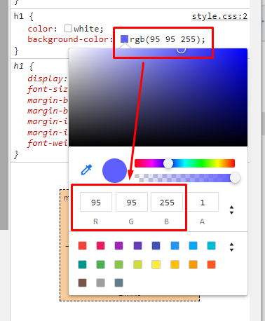
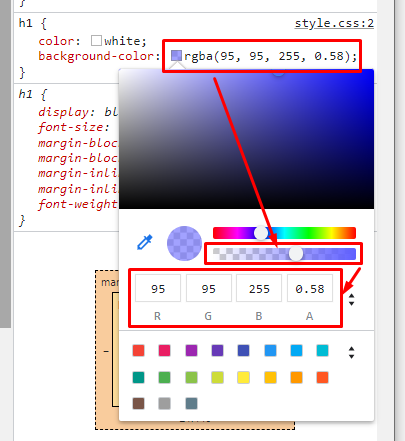
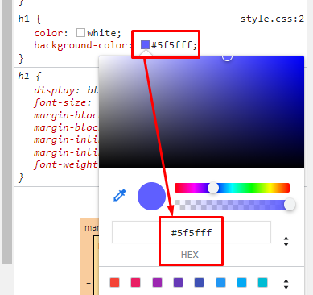
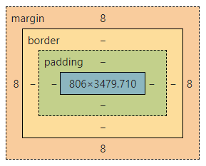
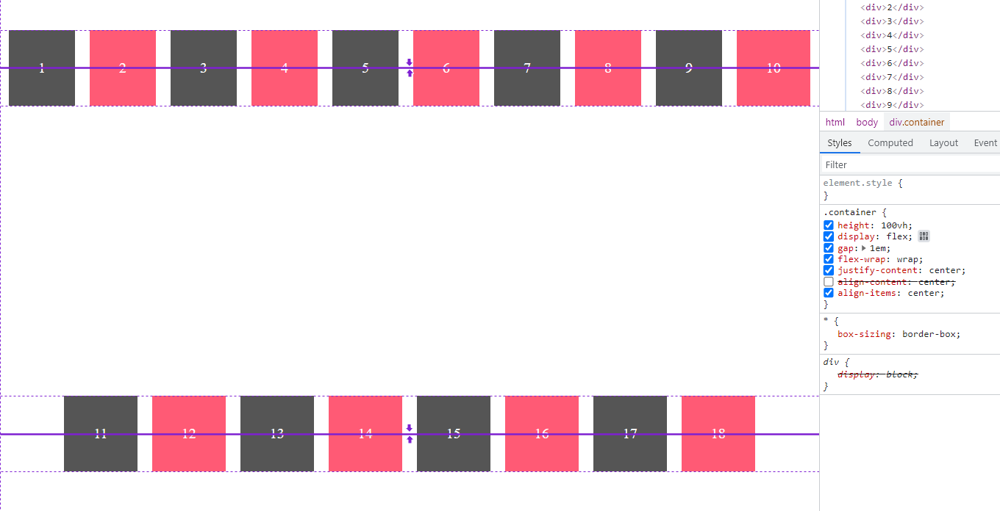

# STUDI - HTML/CSS

- [Introduction](#introduction)
  - [La communication client / serveur](#la-communication-client--serveur)
  - [Le contenu HTML](#le-contenu-html)
  - [Votre premier fichier HTML](#votre-premier-fichier-html)
- [Structure des balises HTML](#structure-des-balises-html)
  - [Balises doubles](#balises-doubles)
  - [Balises simples (ou auto-fermantes)](#balises-simples-ou-auto-fermantes)
  - [Attributs](#attributs)
- [L'inspecteur d'éléments](#linspecteur-déléments)
- [Le cache du navigateur](#le-cache-du-navigateur)
- [Les balises head et body](#les-balises-head-et-body)
- [Les balises de titres](#les-balises-de-titres)
- [Lien hypertexte](#lien-hypertexte)
  - [Faire un lien interne à la page](#faire-un-lien-interne-à-la-page)
- [Les commentaires](#les-commentaires)
- [Les images](#les-images)
- [Les chemins relatifs et absolus](#les-chemins-relatifs-et-absolus)
  - [Chemin absolu](#chemin-absolu)
  - [Chemin relatif](#chemin-relatif)
- [div : la balise de division de contenu](#div--la-balise-de-division-de-contenu)
- [Les types de balises](#les-types-de-balises)
  - [Les balises block](#les-balises-block)
  - [Les balises inline](#les-balises-inline)
- [CSS](#css)
  - [Syntaxe générale](#syntaxe-générale)
  - [Liaison avec un fichier HTML](#liaison-avec-un-fichier-html)
  - [Couleurs (texte, arrière-plan)](#couleurs-texte-arrière-plan)
    - [Un nom](#un-nom)
    - [RGB](#rgb)
    - [RGBA](#rgba)
    - [HEX](#hex)
  - [Les sélecteurs](#les-sélecteurs)
    - [Les pseudo-classes](#les-pseudo-classes)
  - [La différence entre une classe et un id](#la-différence-entre-une-classe-et-un-id)
    - [id](#id)
    - [Classe](#classe)
  - [Les balises HTML : des boîtes](#les-balises-html--des-boîtes)
  - [Les unités de mesure](#les-unités-de-mesure)
    - [px : Pixels](#px--pixels)
    - [em & rem](#em--rem)
    - [% : le pourcentage](#--le-pourcentage)
    - [vw & vh : Viewport width & Viewport height](#vw--vh--viewport-width--viewport-height)
  - [Le positionnement](#le-positionnement)
    - [Une navigation collée en haut de l'écran (sticky)](#une-navigation-collée-en-haut-de-lécran-sticky)
  - [Le modèle Flexbox](#le-modèle-flexbox)
    - [Le conteneur](#le-conteneur)
    - [Les enfants](#les-enfants)
  - [Le ratio des images](#le-ratio-des-images)

## Introduction

**HTML** = HyperText Markup Language
**CSS** = Cascading Style Sheet

### La communication client / serveur


Le **client**, un navigateur web, va communiquer avec un **serveur** via le protocole **HTTP**.

Le serveur, en réponse, va lui envoyer une réponse **HTML**.

Cette réponse peut être issue d'un document HTML **statique**, tel que ceux que nous allons réaliser ensemble tout au long de ce module, ou bien issue d'une application web plus complexe, et plus **dynamique** : dans ce cas, la réponse est adaptée au contexte dans lequel on se trouve (si je suis connecté, alors je vois _mon feed_ et pas celui d'un autre...).

### Le contenu HTML

Sur n'importe quel site, vous pouvez consulter le code HTML de la page, en faisant un clic droit n'importe où sur la page et en cliquant sur "Inspecter".

> Vous pouvez également utiliser la touche _F12_ pour ouvrir l'inspecteur d'éléments, sous Windows, ou encore _Command+Shift+C_ sur Mac

Sur toutes les pages qu'on va visiter, nous aurons au minimum cette **structure** dans les outils de développement (inspecteur d'éléments) :

```html
<!DOCTYPE html>
<html>
  <head></head>
  <body></body>
</html>
```

> Le contenu HTML d'une page représente sa structure, c'est-à-dire l'ensemble des éléments qui composent la page

### Votre premier fichier HTML

Pour pouvoir créer et éditer votre premier fichier HTML, vous allez installer un **IDE** : Integrated Development Environment.

Dans ce module, j'utiliserai [Visual Studio Code](https://code.visualstudio.com/).

Vous pouvez reprendre le [replay du live n°1](https://app.studi.fr/#/dashboard/events/26365/replay) pour avoir les détails d'installation et de configuration, ainsi que les extensions à installer.

Dans Visual Studio Code, on va ouvrir un dossier en passant par le menu ou en utilisant le raccourci _Ctrl+K Ctrl+O_.

Le fait d'ouvrir un dossier nous permet de nous placer dans un **environnement de travail**. C'est dans ce dossier qu'on pourra créer nos différents fichiers.

Une fois dans ce dossier, on va créer un fichier `index.html`, et y inscrire ce contenu :

```html
<!DOCTYPE html>
<html lang="fr">
  <head></head>
  <body>
    Coucou
  </body>
</html>
```

Ensuite, on va se rendre dans un navigateur, puis ouvrir ce fichier directement avec le raccourci _Ctrl+O_.

On doit normalement voir apparaître "Coucou" à l'écran.

## Structure des balises HTML

Lors de la réalisation de nos maquettes HTML, nous utiliserons 2 types de balises :

- Les balises doubles
- Les balises simples (ou auto-fermantes)

### Balises doubles

La structure est très simple :

```html
<balise> ... </balise>
```

Le principe est d'avoir un "tag" d'ouverture et un autre de fermeture. Ainsi, on peut y inscrire du contenu supplémentaire.

Exemple :

```html
<head>
  <title>Le titre de ma page qui s'affichera dans l'onglet</title>
</head>
```

Ici, nous avons utilisé 2 balises doubles : les balises `head` et `title`.

### Balises simples (ou auto-fermantes)

La syntaxe est légèrement différente, mais très simple à retenir :

```html
<balise />
```

Pour le moment nous n'en avons pas encore utilisé concrètement, mais nous en verrons plusieurs.

A titre d'exemple, tout de même, si vous voulez faire un retour à la ligne dans une page, vous pouvez utiliser la balise `br` :

```html
<br />
```

Une petite note supplémentaire sur la syntaxe des balises simples : ça fonctionne aussi sans le `/`, donc sous la forme `<balise>`. Mais personnellement, j'utilise beaucoup plus souvent la syntaxe avec le `/` pour l'auto-fermeture.


> Important : chaque balise HTML a un rôle précis, on n'utilise pas les balises au hasard. On vient de découvrir, notamment, que la balise `title` sert à définir le titre de la page, qui apparaîtra dans l'onglet du navigateur par exemple. Ou encore `br`, qui est une balise simple, pour faire un retour à la ligne

### Attributs

Dans toutes les balises, on peut ajouter des attributs sous la forme suivante :

```html
<balise attribut="valeur"></balise>
<balisesimple attribut="valeur" />
```

Par exemple, dans la balise `<html>`, on retrouve l'élément `lang` avec la valeur `fr` :

```html
<html lang="fr">
  ...
</html>
```

## L'inspecteur d'éléments

Dans votre navigateur, vous pouvez **inspecter** le contenu de la page que vous avez à l'écran. En gros, vous pouvez explorer son code source (et son CSS, on le verra plus tard) :


Vous pouvez également modifier le code se trouvant dans la partie "Elements".

> Attention, si vous réalisez un changement, cela ne signifie pas que vous avez modifié le site, vous avez seulement changé l'apparence dans votre navigateur, donc pour vous uniquement. Si je change "Coucou" en un autre texte, cela n'aura pas modifié mon fichier dans VSCode

## Le cache du navigateur

Le cache du navigateur permet au navigateur, quand il affiche une page, de stocker les fichiers (images, CSS, etc...) associés à cette page. Ainsi, si vous souhaitez consulter la même page un peu plus tard, il n'est pas obligé d'aller demander au serveur, il peut vous afficher de nouveau la même page.

> Pensez, quand vous voulez faire des changements dans votre page HTML et que vous l'avez correctement enregistré dans VSCode, à rafraîchir avec le raccourci `Ctrl+R` ou `Ctrl+Shift+R` au lieu de `F5`. Cela est censé vider le cache pour la page que vous voulez rafraîchir

## Les balises `head` et `body`

Les balises `head` et `body` sont **indispensables** dans toute page web.

Elles se trouvent toutes les deux en-dessous de la balise **racine**, la balise `html`.

- La balise `head` permet de décrire au navigateur les **métadonnées** concernant la page qu'on souhaite afficher. Par exemple, quand on utilise la balise `title`, alors on doit l'inscrire dans la balise `head` et pas ailleurs. Son rôle est d'indiquer au navigateur le titre de la page. Mais ce titre n'est pas forcément celui qui apparaîtra dans la page. En l'occurence, on voit que le navigateur s'en sert pour l'afficher dans l'onglet

- La balise `body`, comme son nom l'indique, représente le **corps** de la page : c'est ce qu'on va voir à l'écran

## Les balises de titres

Les balises de `h1` à `h6` permettent, dans le body, d'indiquer au navigateur des titres d'importances variées. Le niveau 1 sera le plus important, on essayera donc de n'avoir qu'une seule balise `h1` sur notre page. Les niveaux de 1 à 6 vont du plus important au moins important.

## Lien hypertexte

La balise `a` est une **balise double**, elle doit avoir au moins un attribut pour nous permettre de naviguer : `href`.

```html
<a href="https://github.com">Cliquez ici pour aller sur Github</a>
```

On a également vu qu'on pouvait forcer l'ouverture du lien dans un nouvel onglet, en ajoutant l'attribut `target` avec la valeur `_blank` :

```diff
-<a href="https://github.com">Cliquez ici pour aller sur Github</a>
+<a href="https://github.com" target="_blank">Un clic sur ce lien s'ouvrira dans un nouvel onglet</a>
```

### Faire un lien interne à la page

On peut également créer un lien qui pointe vers un autre élément de la page.

Pour ce faire, il faut commencer par donner un **identifiant unique** à l'élément. Nous utilisons l'attribut `id` pour ça :

```html
<p id="important">
  ...
</p>
```

Ensuite, dans notre balise de lien, nous pouvons pointer vers cet élément à l'aide d'un `#` suivi de l'identifiant cible :

```html
<a href="#important">Lien vers le paragraphe important</a>
```

Lors du clic, le navigateur se positionnera à hauteur de l'élément important.

> On peut également pointer un identifiant d'une autre page en indiquant le nom de la page puis `#identifiant`. L'attribut href prendrait alors la valeur `pagecible.html#identifiant`

## Les commentaires

Les commentaires, dans n'importe quel langage de programmation, permettent d'écrire du contenu qui sera ignoré par l'interpréteur (votre navigateur) ou le compilateur (s'il s'agit d'un langage compilé).

En HTML, la syntaxe est la suivante :

```html
<!-- Voici un commentaire -->
```

On doit donc encadrer un commentaire par `<!--` et `-->`.

On peut également l'écrire sur plusieurs lignes :

```html
<!--
Voici un commentaire sur
plusieurs lignes
Parce qu'il est un peu plus long à lire
Donc on peut utiliser plusieurs lignes
pour l'écrire
-->
```

On peut par exemple utiliser les commentaires pour décrire une partie du code qu'on a écrit :

```html
<!-- Suite de titres par ordre d'importance -->
<h1>Coucou</h1>
<h2>Coucou</h2>
<h3>Coucou</h3>
```

Alors, à l'écran, on ne verra pas la première ligne, mais seulement les titres.

> Attention, tout commentaire HTML apparaît quand même dans la source de la page, donc dans vos outils de développement si vous les ouvrez ! Veillez donc à ne pas indiquer d'informations sensibles ou confidentielles dans les commentaires HTML

On peut aussi utiliser les commentaires pour désactiver une partie de notre code :

```html
<p>
  Lorem ipsum dolor sit amet
  <!-- <br /> -->
  Pariatur perspiciatis maxime cupiditate, facere illo at eum explicabo nemo
  et veritatis!
</p>
```

Dans l'exemple ci-dessus, la balise `<br />` sera ignorée par le navigateur, bien que le commentaire apparaisse quand même dans le code source de la page.

## Les images

Avec la balise **simple** ``, nous avons la possibilité d'intégrer des images dans nos pages.

Nous devons simplement définir au minimum 2 attributs à cette balise : la source de l'image à afficher, et un texte alternatif décrivant l'image si celle-ci n'a pas pu être chargée.

```html

```

## Les chemins relatifs et absolus

Dans la section ci-dessus, décrivant la balise `img`, on a indiqué dans l'attribut `src` un chemin vers l'image à afficher.

Ce chemin peut être soit **absolu**, soit **relatif**.

### Chemin absolu

Un chemin absolu désigne un chemin **complet** vers une ressource.

Le terme complet signifie que les éléments inclus dans le chemin vont de la **racine** jusqu'au nom du fichier.

Exemple :

```html

```

Ici, j'utilise un chemin local, donc sur ma machine. La racine désigne la lettre du lecteur, puis l'ensemble du chemin à parcourir jusqu'au fichier.

On peut également définir des chemins absolus se trouvant sur internet :

```html

```

> Note : il est possible que Google retire cette image plus tard, puisqu'elle fait référence à un événement particulier, le nouvel an chinois de 2022. C'est donc normal si en suivant ce lien plus tard qu'en Février 2022, le fichier n'existe plus

Ici, la racine de mon chemin est `https://www.google.com/`, puis l'ensemble des dossiers à parcourir pour aller chercher le fichier d'extension `.gif`.

### Chemin relatif

Un chemin relatif, quant à lui, n'inclura pas l'ensemble du chemin du fichier.

A la place, on va désigner un chemin **relativement au répertoire courant**.

Comment déduire le répertoire courant ?

Par exemple, si je me trouve dans le fichier `index.html` et que je souhaite intégrer une image, alors je vais regarder le répertoire dans lequel se trouve `index.html` : c'est mon répertoire courant.

Ensuite, si j'ai dans le même répertoire un dossier `img/`, comme c'est notre cas ici, je peux le désigner directement, puis indiquer l'image se trouvant dans `img/` :

```html

```

Alors, lorsqu'on va afficher la page, le navigateur va **résoudre** automatiquement le chemin en partant de notre répertoire courant. Pour ce faire, il prend en compte le fichier que nous sommes en train de consulter, et résout le chemin vers l'image.

> Les chemins relatifs sont donc _généralement_ à privilégier : ce sera plus utile pour déployer une maquette en ligne, car elle pourra fonctionner de la même façon que votre version locale

## `div` : la balise de division de contenu

Nous avons déjà vu ensemble quelques balises et leur utilité. En réalité, il existe une autre balise à vocation plus généraliste : la balise `div`.

Elle va vous permettre de déclarer des conteneurs (c'est une balise double), mais sans leur donner une signification particulière dans le code HTML. En gros, si vous n'avez pas besoin d'un titre, d'un paragraphe, d'un lien, etc...mais que vous avez quand même besoin d'occuper un espace, pour un contenu, alors vous pouvez utiliser une div.

La syntaxe est très simple, comme une balise double :

```html
<div>
  <!-- Mon contenu -->
</div>
```

> Pourquoi on parle de cette balise qui semble ne servir à rien, au premier abord ? Parce qu'en réalité, c'est l'une des balises les plus utilisées sur le web

## Les types de balises

Nous allons voir ensemble les 2 types principaux de balises HTML, et leur différence fondamentale. Nous avons déjà vu maintes fois que le fait d'écrire du HTML permettait de parler à un navigateur, qui peut comprendre, interpréter notre code.

Selon les balises qu'on va utiliser, le navigateur va, par défaut, les afficher différemment.

### Les balises block

La caractéristique des balises `block` est qu'elles vont occuper tout l'espace horizontal disponible.

Exemple : h1, h2, h3, h4, h5, h6, div, p...


Ainsi, à l'écran, dans un navigateur, elles vont systématiquement se placer sous la balise précédente, et au-dessus de la balise suivante. Car en occupant tout l'espace horizontal disponible, alors elles repoussent la balise suivante sur une nouvelle ligne.

### Les balises inline

Les balises `inline`, quant à elle, n'occupent que l'espace horizontal nécessaire à leur affichage.

Exemple : a, img...


## CSS

CSS est l'acronyme de **Cascading Style Sheet**.

Nous avons vu ensemble que HTML permettait de définir le **squelette**, ou encore le **corps** de la page. CSS, quant à lui, définit l'habillage, l'apparence des éléments de notre page.

### Syntaxe générale

Comme tout langage, CSS a sa syntaxe.

Globalement, pour appliquer une apparence à un élément de la page, cela se déroulera en 2 temps : on indique un sélecteur, pour pouvoir cibler l'élément qu'on veut styliser, puis on applique des valeurs à des règles (ou propriétés) CSS, entre des accolades.

Exemple :

```css
h1 { /* <-- Sélecteur : toutes les balises h1 */
  color: blue; /* <-- Règle : couleur du texte, Valeur : bleu */
}
```

> Note : vous constatez qu'on peut également écrire des commentaire en CSS avec la syntaxe `/* ... */`

Chaque règle a un nom et un but bien particulier. Nous pouvons donc déclarer plusieurs règles, les unes à la suite des autres, pour un sélecteur donné. Chaque ligne spécifiant une valeur pour une règle donnée doit être terminée par un point-virgule.

Autre exemple :

Nous parlions plus tôt des types de balises (block, inline). La règle CSS associée à ces valeurs est `display`.

Ainsi, pour un élément donné, qui serait par exemple `inline` par défaut, on peut tout à fait changer sa propriété CSS `display` pour le passer en `block` :

```css
a { /* <-- a est un élément inline par défaut */
  display: block;
}
```

### Liaison avec un fichier HTML

Lorsque vous avez déclaré un ensemble de règles et les valeurs à associer pour des sélecteurs donnés, vous souhaitez appliquer cette **feuille de styles** à un document HTML.

Pour ce faire, il suffit de vous rendre dans votre document HTML, et d'utiliser une balise `link` dans la partie `head` de votre page :

```html
<head>
  <!-- ... -->
  <link rel="stylesheet" href="style.css" />
  <!-- ... -->
</head>
```

### Couleurs (texte, arrière-plan)

La propriété de couleur de texte en CSS est `color`. Pour la couleur d'arrière-plan, on peut utiliser `background-color`.

Dans les deux cas, ces propriétés attendent une valeur représentant une couleur, afin que le navigateur puisse l'appliquer sur l'élément cible.

En CSS, on peut représenter une couleur de façons différentes.

#### Un nom

On peut spécifier une couleur avec un nom : `white`, `blue`, `yellow`, ...

#### RGB

RGB est l'acronyme de **Red, Green, Blue**. Quand vous définissez une couleur en RGB, vous définissez la quantité de bleu, vert et rouge que vous allez inclure dans votre couleur finale. Cela va nous permettre de définir des couleurs plus fines que `blue`, si vous voulez un bleu un peu plus clair par exemple.



#### RGBA

RGBA ajoute une notion de transparence dans la couleur, avec un paramètre supplémentaire (alpha).



#### HEX

Vous pouvez également spécifier une valeur en **hexadécimal**. Dans ce cas, vous allez utiliser une base 16 et non plus une base 10.

La base 10 permet de compter de 0 jusqu'à 9, puis de 10 jusqu'à 19, etc...10 par 10.

En base 16, on va compter de 0 jusqu'à 9, puis de A jusqu'à F :

|Base 16  |0  |1  |2  |3  |4  |5  |6  |7  |8  |9  |A  |B  |C  |D  |E  |F  |
|---------|:-:|:-:|:-:|:-:|:-:|:-:|:-:|:-:|:-:|:-:|:-:|:-:|:-:|:-:|:-:|:-:|
|Base 10  |0  |1  |2  |3  |4  |5  |6  |7  |8  |9  |10 |11 |12 |13 |14 |15 |



Une couleur en hexadécimal est représentée sur 6 caractères. En réalité, si on divise par 3, alors on peut retrouver notre RVB (ou RGB en anglais).

Dans l'image ci-dessus, nous avons la valeur `#5f5fff`. Il s'agit de la représentation hexadécimale de notre précédent exemple en RGB.

Prenons les 2 premiers caractères, `5f`. Il doit s'agir, logiquement, de la quantité de R, donc rouge, dans notre couleur.

Dans la représentation RGB, nous avions `95` pour le rouge, donc en base 10.

Si nous comptons, à la place, en base 16, alors logiquement nous devrions avoir le tableau de comparaison base 10 et base 16 ci-dessus, de 0 jusqu'à 15, puis, 16 en base 10 équivaut donc à 10 en base 16.

Donc si nous allons de 16 en 16 :

|Base 10  |16 |...|32 |...|48 |...|64 |...|80 |
|---------|:-:|:-:|:-:|:-:|:-:|:-:|:-:|:-:|:-:|
|Base 16  |10 |...|20 |...|30 |...|40 |...|50 |

Puis :

|Base 10  |81 |82 |83 |84 |85 |86 |87 |88 |89 |90 |91 |92 |93 |94 |95 |
|---------|:-:|:-:|:-:|:-:|:-:|:-:|:-:|:-:|:-:|:-:|:-:|:-:|:-:|:-:|:-:|
|Base 16  |51 |52 |53 |54 |55 |56 |57 |55 |59 |5A |5B |5C |5D |5E |5F |

On retrouve donc bien l'équivalent `5F` en base 16, pour la valeur `95` qu'on trouvait en base 10 dans notre couleur représentée en RGB initialement.

La couleur noire sera donc `#000000` et la couleur blanche `#FFFFFF`.

> Note : On peut raccourcir la représentation hexadécimale si les caractères sont les mêmes : `#000000` peut être `#000`, `#FFFFFF` sera `#FFF`, `#FF0000` devient `#F00`, etc...

### Les sélecteurs

Les sélecteurs CSS nous permettent de cibler, dans le fichier HTML où notre fichier CSS sera inclus, des éléments précis de l'arborescence.

Pour chacun des éléments correspondants, le navigateur appliquera l'ensemble des règles CSS indiquées.

|Sélecteur|Syntaxe (exemple)|Description (ce qui est sélectionné)|
|---|---|---|
|Balise HTML| p {} | Toutes les balises HTML correspondant au nom indiqué|
|Classe| .nomDuneClasse {} | Toutes les balises HTML ayant un attribut `class` contenant le nom indiqué|
|Identifiant| #identifiant {} | Toutes les balises HTML ayant un attribut `id` correspondant au nom indiqué|
|sélecteur dans sélecteur|nav ul {}| Ici par exemple, toutes les balises `ul` qui se trouvent à l'intérieur d'une balise `nav` (un espace pour séparer)|
|enfant direct|nav > ul {}| Ici par exemple, toutes les balises `ul` qui se trouvent à l'intérieur d'une balise `nav`, mais qui en sont les **enfants directs**, donc qui se trouvent juste en-dessous, à un niveau d'indentation supplémentaire seulement|

> Je rajouterai dans ce tableau les sélecteurs que nous aurons découverts au cours de notre apprentissage

#### Les pseudo-classes

Les pseudo-classes s'appliquent sur des sélecteurs CSS : on ajoute `:` puis le nom de la pseudo-classe. Cela nous permettra, pour un sélecteur donné, de cibler un sous-ensemble des éléments correspondants par exemple, ou bien un état précis de l'élément (souris qui passe dessus, clic, ...)

|Sélecteur|Syntaxe (exemple)|Description (ce qui est sélectionné)|
|---|---|---|
|N'est pas| :not() | élément qui n'est pas ce qui est indiqué entre parenthèses|
|Dernier enfant| :last-child| Au sein de plusieurs enfants, cibler le dernier de leur parent|
|nth-of-type|.container > div:nth-of-type(even)| Dans l'exemple ci-contre, sélectionne tous les éléments se trouvant aux positions paires qui sont des `div` se trouvant être les enfants directs d'un élément portant la classe `container`|

### La différence entre une classe et un id

Pour n'importe quelle balise dans notre `body`, nous pouvons spécifier un identifiant ou bien une classe.

#### id

Un identifiant peut servir à plusieurs choses :

- Mettre un repère dans une page pour faire un lien vers celle-ci (voir la section sur les liens)
- Pouvoir désigner un élément de formulaire quand on veut lui associer un libellé (nous verrons ça plus tard avec les formulaires)
- Pouvoir récupérer un élément de la page avec du Javascript

Dans ces 3 exemples, une caractéristique qui ressort, et qui doit être respectée, est **l'unicité** du nom.

Un identifiant, dans une page, doit être unique. On ne donnera donc pas le même identifiant à 2 balises HTML différentes.

#### Classe

Une classe peut être vue, du point de vue CSS, comme une _classe d'affichage_.

Par exemple, nous avons défini une classe `.important` dans notre CSS, car nous souhaitions pouvoir afficher en gras le ou les textes que nous jugeons importants.

Contrairement à l'identifiant, le nom de classe peut donc être **réutilisé** dans une même page, sur plusieurs balises.

Par ailleurs, il est possible de **cumuler** plusieurs classes sur une balise. Voir pour ça l'exemple de notre texte important que nous avons passé en rouge :

Dans notre CSS :

```css
p {
  color: #6b8aaa;
}

.important {
  font-weight: bold;
}

.red {
  color: red;
}
```

Et notre HTML :

```html
<p class="important red">
  Lorem ipsum dolor sit amet consectetur adipisicing elit. Iste, quidem
  voluptatem? Obcaecati a distinctio ullam quisquam?
  <!-- ... -->
</p>
```

> Ci-dessus, on définit que les balises `p` doivent être colorées avec le code couleur `#6b8aaa`, mais nous indiquons ensuite que les éléments portant la classe `red` doivent être colorés en rouge. A l'écran, dans le navigateur, le texte est affiché en rouge : la règle déclarée dans la classe `red` a pris le dessus. Si on voulait que la règle déclarée dans la balise `p` garde le dessus, on pourrait utiliser `!important` : `color: #6b8aaa !important;`. Mais c'est une pratique dont il ne faut pas abuser, au risque de perdre en cohérence

### Les balises HTML : des boîtes

Chaque balise HTML interprétée et affichée par le navigateur est en fait comme une **boîte**.

Elle va avoir un contenu, des bordures, etc...

Sa structure peut être visible dans l'inspecteur d'éléments, dans la partie CSS :



Depuis l'intérieur vers l'extérieur :

- Contenu de la balise : c'est là-dedans que s'affichera le texte, les images, etc...
- **padding** : marge intérieure de l'élément, entre le contenu et la bordure
- **border** : bordures de l'élément
- **margin** : marge extérieure de l'élément

> Les 3 mots en gras sont des termes à retenir. En HTML, si on parle de _margin_, alors on parle de la marge **extérieure**, et inversement pour le _padding_

Chacun de ces nouveaux termes peut être décliné sur chaque côté de l'élément. Ainsi, on pourra définir une marge extérieure supérieure sur un élément en utilisant la règle `margin-top`, ou bien une bordure inférieure avec `border-bottom`.

Si on utilise `margin: 15px;`, alors on définit une marge extérieure de 15 pixels pour les 4 côtés de l'élément en même temps.

> Sur la capture d'écran ci-dessus, on voit que l'élément a une marge extérieure de 8 pixels. En fait, l'élément en question est le `body`. Le navigateur applique par défaut une marge extérieure de 8 pixels sur cet élément

### Les unités de mesure

Quand on veut définir une règle sur un élément, comme une marge ou une bordure, on peut indiquer l'épaisseur voulue, ou la largeur par exemple avec la règle CSS `width`.

Dans ce cas, on va utiliser une unité de mesure pour indiquer au navigateur comment afficher l'élément et appliquer la règle.

#### px : Pixels

L'unité de mesure en pixels est très précise.

Par exemple, si je souhaite appliquer une bordure sur un élément, je peux utiliser la règle `border` :

```css
/* Bordure de 2px de large, en ligne pleine, de couleur noire */
border: 2px solid black;
```

Le désavantage de cette règle, cependant, est qu'il s'agit d'une unité de mesure **absolue**. 2 pixels, c'est 2 pixels, et ça ne bougera pas. Ainsi, notre layout (disposition de notre page) n'est pas très **flexible**. Donc c'est précis, mais moins flexible que des unités de mesure **relatives**.

#### em & rem

Comme vu précédemment, si on veut définir une bordure par exemple, on peut tout à fait utiliser une valeur absolue. L'unité de mesure en pixels est loin d'être inutile.

En revanche, si on souhaite dimensionner un texte par exemple, nous aurons probablement plus besoin d'une unité de mesure **relative**.

Alors, relative à quoi ? Regardons un exemple.

Quand j'utilise une balise `h1`, le navigateur applique un style par défaut :

```css
h1 {
  display: block;
  font-size: 2em; /* <-- Taille du texte, unité de mesure en 'em' */
  margin-block-start: 0.67em;
  margin-block-end: 0.67em;
  margin-inline-start: 0px;
  margin-inline-end: 0px;
  font-weight: bold;
}
```

L'utilisation de l'unité `em` permet ici de dire au navigateur "applique une taille de texte 2 fois plus grande que la première taille de texte que tu trouveras plus haut dans l'arborescence".

> Généralement, l'élément `h1` se trouve assez haut dans l'arborescence, donc on va souvent hériter de la taille de texte définie sur le `body` par exemple (par défaut : 16px)

Donc par défaut, notre `h1` possèderait une taille de police de 32px, dans ce cas.

Maintenant, si je souhaite appliquer, par exemple, un `margin` sur mon `h1`, je peux utiliser une taille relative également :

```css
h1 {
  margin: 3em;
}
```

Or, dans ce cas, la marge appliquée par le navigateur sera de **96px**. C'est en fait 3 fois la `font-size` appliquée sur notre `h1` !

Si on veut conserver une taille relative à la taille **de base**, alors on doit utiliser `rem` comme unité de mesure. On indique ainsi au navigateur d'utiliser le **root em**, donc de se référer à la racine.

```css
h1 {
  margin: 3rem;
}
```

Avec l'unité `rem`, on aura bien une marge de **48px**, soit 16px x 3.

Ainsi, on peut donc décider, par la suite, de faire évoluer notre taille de police de base. L'élément racine étant `html`, on peut tout à fait décider que la taille de police de base n'est plus 16px mais 20px :

```css
html {
  font-size: 20px;
}
```

Alors, dans ce cas, toutes les règles que nous avons définies comme relatives suivront : notre layout est plus flexible.

#### % : le pourcentage

On peut également utiliser le pourcentage comme unité de mesure relative.

Par exemple, pour définir la largeur d'un conteneur :

```css
.monConteneur {
  width: 50%;
}
```

Alors, relativement à son **parent**, il devrait occuper 50% de l'espace.

#### vw & vh : Viewport width & Viewport height

`vw` et `vh` permettent d'indiquer la largeur ou la hauteur d'un élément par rapport au **viewport** : la zone affichée à l'écran. Elle agit comme un pourcentage (`100vh` = 100% de la hauteur de la zone affichée à l'écran).

### Le positionnement

Du point de vue du navigateur, chaque élément a un **positionnement** (en CSS, règle : `position`).

Le positionnement par défaut est `static`. Suivant le type de l'élément (`block` ou `inline`), le navigateur le positionne à la suite des autres, sans adaptation particulière.

Les principaux positionnements utilisés sont :

- relative
- absolute
- fixed
- sticky

#### Une navigation collée en haut de l'écran (sticky)

Dans l'exemple `navigation.html`, on réalise une barre de navigation collée en haut de l'écran quand on scrolle.

Pour ce faire, on va appliquer à notre balise `nav` un positionnement `sticky`, et indiquer au navigateur ou positionner l'élément :

```css
nav {
  position: sticky;
  top: 0px;
}
```

La règle `top` va simplement indiquer au navigateur où positionner l'élément. Relativement au haut (`top` en anglais) de la fenêtre, on le mettra à 0px. Donc collé, tout en haut.

### Le modèle Flexbox

Nous avons vu que les éléments HTML pouvaient être de type `block` ou `inline`.

La règle CSS correspondant à ce type d'affichage est `display`.

On peut également utiliser `display` pour d'autres types d'affichages. Nous allons parler du type `flex`.

Le modèle Flexbox permet, quand il est appliqué sur un conteneur, d'indiquer au navigateur comment distribuer les éléments qui se trouvent dans ce conteneur.

On va donc pouvoir distributer les enfants d'un conteneur de manière beaucoup plus aisée grâce aux règles CSS utilisables soit sur le conteneur, soit sur les enfants.

#### Le conteneur

Au niveau du conteneur, on va dire au navigateur qu'on souhaite appliquer Flexbox avec `display: flex;`.

Quand on applique cette règle sur un conteneur, alors le navigateur, par défaut, va distribuer les enfants de ce conteneur sur un **axe principal** : horizontal (ou `row`).

Il est possible d'indiquer au navigateur d'utiliser l'axe vertical comme axe principal avec la règle `flex-direction: column`.

Par la suite, il est donc possible d'indiquer au navigateur comment aligner les enfants sur l'axe principal, mais également sur l'**axe secondaire**.

> Donc, si par défaut, l'axe principal est `row`, donc l'axe horizontal, alors l'axe secondaire sera l'axe vertical, et l'inverse avec `flex-direction: column`

Pour aligner les enfants sur l'axe principal, on utilisera la règle `justify-content` **toujours au niveau du conteneur** :

```css
/* Pour distribuer les éléments d'une liste par exemple */
nav ul {
  display: flex;
  justify-content: center;
}
```

On utilisera généralement `flex-start`, `flex-end`, `space-around`, `space-between`, `space-evenly`, `center` comme valeurs de cette règle.

Au niveau de l'axe secondaire, on pourra utiliser `align-items` ou `align-content`.

`align-items` va nous permettre d'aligner les **éléments**, au sein d'une ligne, par rapport à l'axe secondaire.

La différence avec `align-content` concerne les lignes. `align-content` n'aura aucun effet sur une ligne seule. Elle aura un effet sur l'alignement de **plusieurs lignes** par rapport à l'axe secondaire.

##### align-items sur une ligne


##### align-items sur plusieurs lignes



##### align-content sur plusieurs lignes


#### Les enfants

Les règles CSS précédemment vues s'appliquent sur le **conteneur**.

Les éléments contenus dans ce conteneur, donc les enfants, peuvent également recevoir des règles CSS.

Par exemple, dans le fichier `img_gallery.css`, on réalise une galerie d'images avec Flexbox :


On peut indiquer au navigateur d'autoriser les enfants à s'élargir si besoin avec la règle `flex-grow`, à appliquer au niveau des enfants.

Par défaut, `flex-grow` est à 0, donc si nous ne l'appliquions pas sur notre galerie, les images ne prendraient pas toute la largeur disponible.

Les 3 règles principalement utilisées sur les enfants permettent de fixer une valeur de base, la possibilité de s'élargir et la possibilité de se rétrécir.

- `flex-grow` : possibilité de s'élargir (par défaut : 0, donc pas possible)
- `flex-shrink` : possibilité de rétrécir l'élément (par défaut : 1)
- `flex-basis` : largeur de base pour ensuite déterminer la largeur finale (par défaut : auto)

Il est également possible d'utiliser la règle `flex` sur les enfants, comme un raccourci de `flex-grow`, `flex-shrink` et `flex-basis` :

```css
element {
  /* --- Premier exemple --- */
  flex: 1;
  /*
  Equivaut à :
  flex-grow: 1;
  flex-shrink: 1;
  flex-basis: 0%;
  */
  /* --- Second exemple --- */
  flex: 1 0;
  /*
  Equivaut à :
  flex-grow: 1;
  flex-shrink: 0;
  flex-basis: 0%;
  */
  /* --- Troisième exemple --- */
  flex: 1 auto;
  /*
  Equivaut à :
  flex-grow: 1;
  flex-shrink: 1;
  flex-basis: auto;
  */
  /* --- Quatrième exemple --- */
  flex: 1 0 auto;
  /*
  Equivaut à :
  flex-grow: 1;
  flex-shrink: 0;
  flex-basis: auto;
  */
}
```

### Le ratio des images

Dans la galerie d'images `img_gallery.html`, pour éviter que les images soient déformées, on applique la règle CSS `object-fit` avec la valeur `cover`.

Ainsi, il est possible que l'image soit légèrement rognée sur les bords mais le ratio reste correct.
